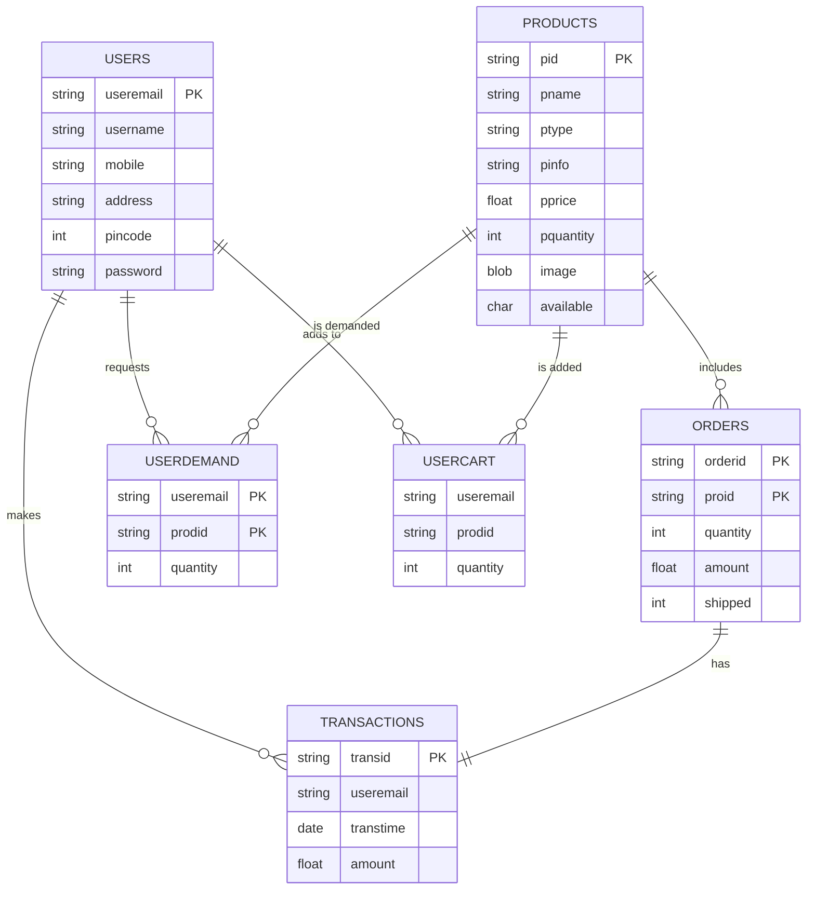

# NeoTronix - Electronic Device E-Commerce Web Application

> **Developed by:** Pushpraj Singh Chauhan

---

## 🎬 Demo Video

> **Click [this link](https://drive.google.com/file/d/16VueDdjppmu-G_nBPm8ThKoevbNIwiCo/view?usp=drive_link) to watch the full demo video of NeoTronix.**

---

## 📋 Overview

**NeoTronix** is a robust full-stack e-commerce platform dedicated to electronic devices, offering a seamless experience for both customers and administrators. With a modular MVC-like design, it provides features such as product browsing, dynamic cart and order management, granular stock control, transaction handling, and a demand system for out-of-stock or new products.

---

## 🚀 Tech Stack

- **Backend:** Java (JSP & Servlets), JDBC, Oracle Database
- **Frontend:** HTML, CSS, JSP, [Bootstrap](https://getbootstrap.com/) (optional)
- **Utilities:** JavaMail API (email notifications), Custom utilities (`DBUtil`, `JavaMailUtil`, `IDUtil`, `AppInfo`)
- **Architecture:** MVC-like, layered packages for POJO, DAO, Servlets, Utilities, Listeners

---

## 🗂️ Directory Structure

```
Neo-Tronix/
│
├── src/
│   └── in/neotronix/
│       ├── pojo/        # Data models for Users, Products, Orders, etc.
│       ├── dao/         # DAO interfaces
│       ├── impl/        # DAO implementations
│       ├── servlet/     # Controllers/Servlets
│       ├── utility/     # Utility classes (DBUtil, MailUtil, etc.)
│       └── listener/    # DB pool listener
│
├── WebContent/
│   ├── css/             # Stylesheets
│   ├── images/          # Product images
│   ├── index.jsp
│   ├── login.jsp
│   ├── register.jsp
│   ├── cartDetails.jsp
│   ├── orderDetails.jsp
│   ├── payment.jsp
│   ├── adminViewProduct.jsp
│   └── ...              # Other JSP pages
│
├── README.md
└── ...
```

---

## 🧠 Entity Relationship Model



---

## 👥 User Roles & Features

The application supports three user perspectives: **Guest User**, **Customer**, and **Admin**.

### 👤 Guest User

- **Product Browsing:** View all available products, categories, and details.
- **Navigation:** Use search bar and category filters.
- **Restricted Actions:** Attempting to add to cart or purchase prompts login/register.

### 🛒 Customer

After login, customers can:

- **Category View:** Filter products by category.
- **Product View:** View product details, stock, and pricing.
- **Add to Cart / Buy Now:** Add products to cart, or buy instantly.
- **Cart Management:** View, modify, or delete items in the cart.
- **Order Placement & Payment:** Simulated payment interface for placing orders. Upon success, the cart is cleared and order history updated.
- **Orders:** Track current and past orders, including shipped/unshipped status.
- **Profile:** View and update personal details.
- **Logout:** Securely end session.

### 🛠️ Admin

After admin login, the following management features are available:

- **Product Management:**
  - **Add Product:** Enter details (name, type, description, price, quantity, image).
  - **Update Product:** Change any product detail using product ID.
  - **Remove Product:** Delete products by ID.
- **Order Management:**
  - **View Orders:** List all orders, filter by shipped/unshipped.
  - **Ship Orders:** Mark unshipped orders as shipped; stock is decremented automatically.
- **Demand Management:**
  - **Customer Demands:** System identifies and processes product demands when stock is updated.
- **Logout:** Securely end session.

---

## 📈 Application Workflow

The application follows a structured workflow for **guest users**, **customers**, and **admins**. Below is the breakdown of how users interact with the system from landing on the homepage to completing transactions or managing the store.

---

### 🏠 1. Home Page (Guest View)

- All available products are displayed to any user visiting the site.
- **Features:**
  - Product listing with **"Add to Cart"** and **"Buy Now"** options.
  - **Search bar** and **navigation bar** with product categories.
  - **Login** and **Register** buttons at the top.
  - **Category sorting** enabled.
- If a guest attempts to add to cart or buy, they will be redirected to the **Login page**.

---

### 🔐 2. Authentication Flow

#### 📝 Registration:

- Required details: Name, Username, Email, Address, Mobile Number, PIN Code, Password.
- Once registered, users can log in as either **Customer** or **Admin**.

#### 🔑 Login:

- User chooses role: **Admin** or **Customer**.
- Inputs username and password.
- Based on role selection, the corresponding dashboard is shown.

---

### 👤 3. Customer Workflow

Once logged in as a **Customer**, the following options are available:

- **Category View:** Filter products by category.
- **Product View:** View product details, available stock, and pricing.
- **Add to Cart:** Add products to the cart.
- **Buy Now:** Directly proceed to payment.
- **Cart:** View, modify, or delete items in the cart.
- **Place Order:**
  - A simulated payment interface is opened.
  - User enters **card details** and confirms payment.
  - Once payment is successful:
    - Cart is emptied.
    - Order history is updated.
- **Orders:** View current and past orders.
- **Profile:** View personal details.
- **Logout:** End session.

---

### 🛠️ 4. Admin Workflow

Once logged in as an **Admin**, the following features are available:

- **Product Management:**
  - **Add Product:** Enter name, type, description, price, quantity, etc.
  - **Update Product:** Update any detail (name, type, price, description, quantity) using the product ID.
  - **Remove Product:** Delete product using product ID.
- **Order Management:**
  - **View Orders:**
    - Shipped Orders
    - Unshipped Orders
  - **Ship Orders:**
    - View list of unshipped orders.
    - Mark selected orders as shipped.
    - Updated status reflected in the order tables.
    - Stock is decreased according to the purchased quantity.
- **Demand Management:**
  - After a product's stock is updated, the system identifies customer **demands** for that product and updates their availability accordingly.

---

### 🔄 5. Redirection Logic

- Any restricted action (like "Add to Cart" or "Buy Now") by a guest redirects to the login screen.
- Role-specific redirection:
  - Customers get the shopping dashboard.
  - Admins get the store management dashboard.

---

## ✨ Key Features

- **Role-based Dashboards:** Unique flows and UIs for admins vs. users.
- **Email Notifications:** Automated emails for registration, order status, etc.
- **Demand System:** Users can request products not in catalog; admins can view/respond.
- **Robust Cart & Order Logic:** Persistent cart, order validation, and transaction recording.
- **Image Management:** Upload and display product images.
- **MVC-Like Architecture:** Separation of concerns for maintainability and scalability.
- **Reusable Utilities:** Database connection pooling, email sending, ID generation.

---

## 📌 Future Enhancements

- **Payment Gateway Integration:** Real online payments.
- **Advanced Search & Filtering:** Smarter product discovery.
- **Pagination:** For large product lists.
- **Mobile App APIs:** RESTful endpoints for mobile clients.
- **Responsive UI:** Enhanced mobile and desktop experience.
---
